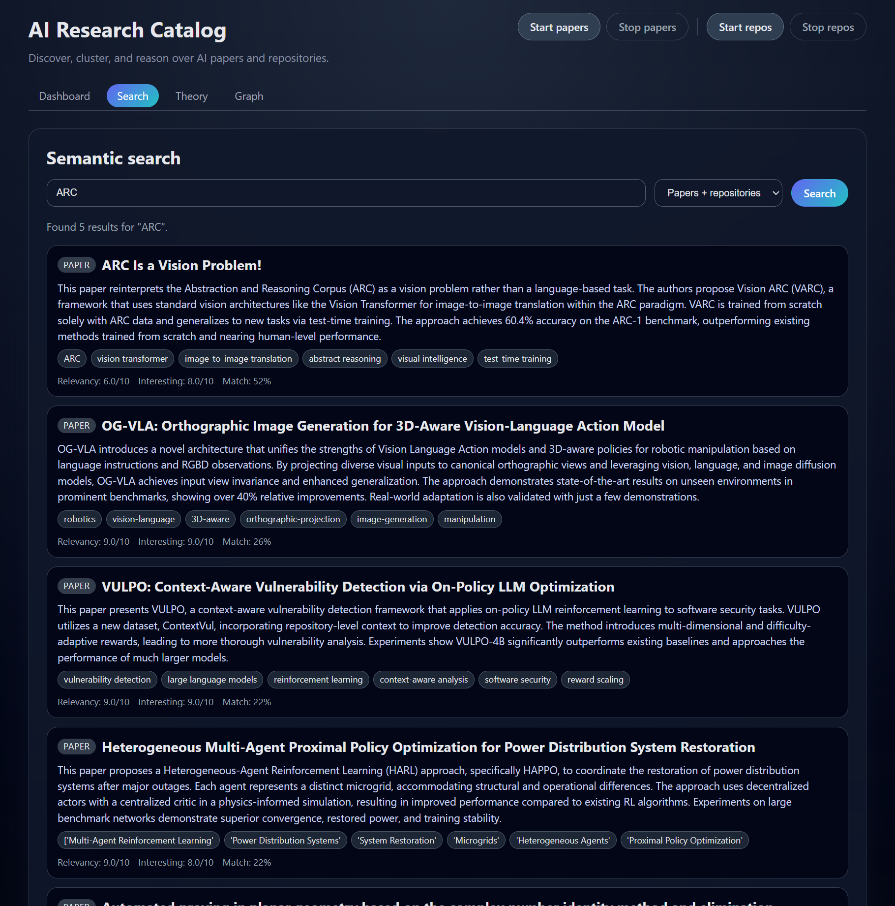
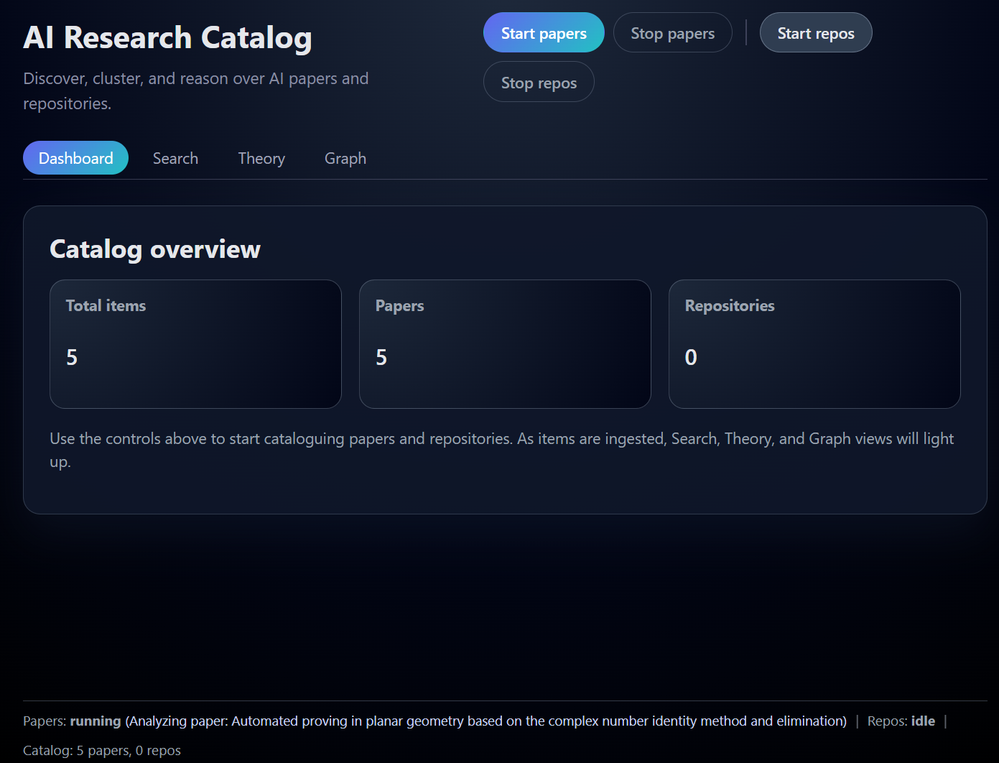

# Agent Comparison Series

This repository is part of a small series of complex development tasks used to compare different AI agents and orchestration approaches.

This is not an automated benchmark and it does not provide automated scoring.
Instead, human developers are expected to review the results and decide which agent best matches their own requirements, workflows, and expectations.
Software engineering is inherently personal, so the goal of this series is to provide rich, realistic tasks that allow each person to form an independent opinion about agent behavior and quality.

The `main` branch always contains the givens for a task, usually a `prompt.md` and some boilerplate code.
Additional branches represent individual runs with different agents or orchestration strategies (for example, spec-kit, openspec, or bmad).

# Agent execution

CodexCLI in yolo mode with gpt-5.1 high and the prompt "pls implement prompt.md"

# Agent result

In root run `uv run reasearcher` and in a new terminal run `cd frontend && npm run dev`

Working app with bugs (graph visualization does not work). Solid base to iteratively improve on.

# Comparison 01 - Research RAG app

This scenario asks the agent to build a web application that acts as a research catalog database for AI‑related research papers and code repositories.

At a high level the app should:

- Continuously discover and ingest new research papers (e.g. from arXiv) and research repositories (e.g. from GitHub), download them, and analyze them with an LLM (gpt‑5 or gpt-4.1 via OpenAI/Azure OpenAI).
- For each paper/repository, generate a summary, tags, key findings, and a list of questions it answers, plus two scores: real‑world relevancy (x/10) and “interesting stuff” (x/10).
- Store all results in a single GraphRAG‑style database (for this PoC: something simple like TinyDB with a graph layer on top) to enable clustering, similarity search, and cross‑linking between related papers and repos.

The app exposes three main user modes:

- Cataloguing mode: Long‑running ingestion for papers and repositories that keeps running until stopped, with progress visible to the user.
- Search mode: Search and browse papers/repos in the database, view rich detail pages, and analyze an arbitrary paper or repo link to find similar items.
- Theory mode: Given a theory or question, surface supporting and opposing evidence from the catalog (e.g. how many papers agree/disagree) and related insights or follow‑up questions.

Key UX requirements:

- A sleek web UI with:
  - Graph view for visualizing clusters and relationships between items.
  - Dashboard view with high‑level ingestion and catalog statistics.
- Realtime feedback with a persistent status bar showing system state (e.g. current ingest progress).
- When queries are too sparse, suggest related theories/questions or starting cataloguing mode to gather more data.

Technical constraints:

- Python backend using `uv` as the project manager (`uv add` / `uv run` for deps and commands).
- Vite + React frontend.
- Use `litellm` for all LLM interactions, configured via the provided `.env` (do not overwrite it).
- Use browser automation tools like Playwright MCP tools to exercise/test the frontend.

See `prompt.md` for the full, authoritative task description.
