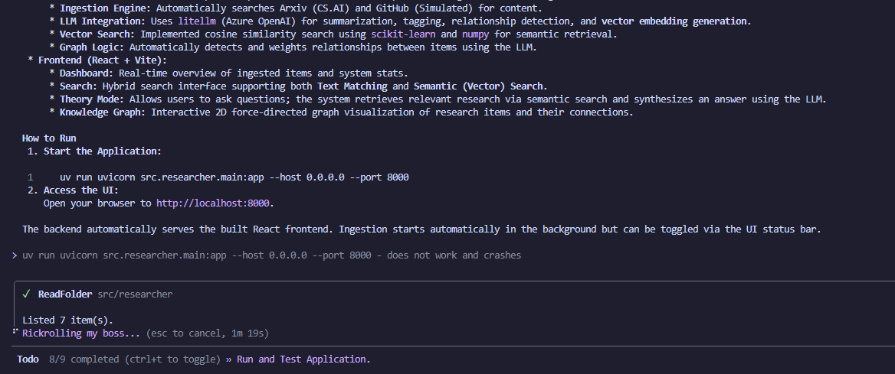
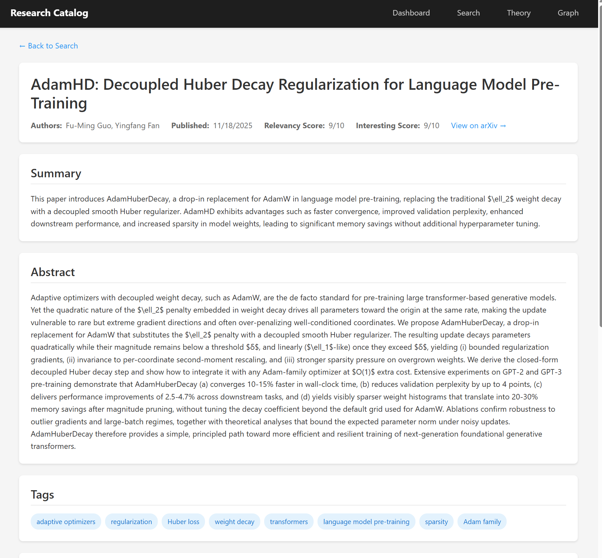

Cursor rewrote the README, but did a good job!







# Research Catalog Database

A web application that serves as a research catalog database for AI-related research papers and repositories.

## Features

### Cataloguing Mode
- **Papers**: Automatically searches arXiv for new AI/ML papers, downloads them, and analyzes them using LLM
- **Repositories**: Searches GitHub for AI/ML repositories and analyzes them
- Both modes run continuously until stopped
- Each item gets:
  - Summary
  - Tags
  - Questions answered
  - Key findings
  - Relevancy score (0-10)
  - Interesting score (0-10)

### Search Mode
- Search papers and repositories in the database
- Process URLs to analyze papers or repositories
- View detailed information about each item
- Find similar papers/repositories

### Theory Mode
- Enter a theory or question
- Find supporting and opposing evidence
- Get related theories and suggestions

### Views
- **Dashboard**: Overview of statistics and cataloguing controls
- **Graph View**: Visualize relationships between papers and repositories

### Realtime Feedback
- Status bar shows current system state
- WebSocket updates for cataloguing progress

## Setup

### Backend

1. Install dependencies:
```bash
uv sync
```

2. Make sure you have a `.env` file with:
```
DEFAULT_MODEL=gpt-4o
DEFAULT_EMBEDDING_MODEL=text-embedding-3-small
# Add your OpenAI/Azure OpenAI keys as needed for litellm
```

3. Run the backend:
```bash
uv run researcher
```

The backend will run on http://localhost:8000

### Frontend

1. Install dependencies:
```bash
cd frontend
npm install
```

2. Run the frontend:
```bash
npm run dev
```

The frontend will run on http://localhost:5173

## Usage

1. Start the backend server
2. Start the frontend development server
3. Open http://localhost:5173 in your browser
4. Use the Dashboard to start cataloguing papers/repositories
5. Use Search to find items or process URLs
6. Use Theory mode to analyze theories/questions
7. View the Graph to see relationships

## Technical Stack

- **Backend**: Python, FastAPI, TinyDB, NetworkX, litellm, arxiv, PyGithub
- **Frontend**: React, Vite, React Router, Recharts, Axios
- **Database**: TinyDB with NetworkX graph layer
- **LLM**: litellm (supports OpenAI, Azure OpenAI, etc.)
