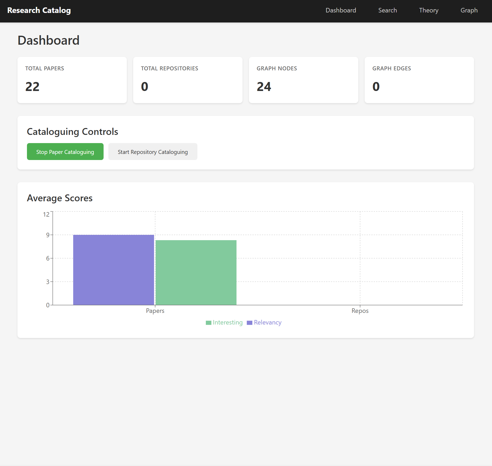

GPT-5-Codex-Max High is obviously the clear winner



# Research Catalog Database

Research catalog that ingests AI papers/repos, summarizes them with LiteLLM, stores them in a TinyDB + graph layer, and serves a sleek React UI with dashboard, search, theory, and graph views.

## Backend (FastAPI + uv)

Prereqs: Python 3.12+, `.env` containing `DEFAULT_MODEL`, `DEFAULT_EMBEDDING_MODEL`, and API keys for LiteLLM providers. Optional: `GITHUB_TOKEN` to avoid rate limits.

```
uv run researcher
```

The server listens on `http://localhost:8000`.

Key endpoints:
- `POST /ingest/paper/start` & `POST /ingest/repo/start` — begin long‑running cataloguing loops (arXiv + GitHub).
- `POST /ingest/{kind}/stop` — stop loops.
- `GET /status` — realtime ingest status bar data.
- `POST /search` — semantic search across papers and repos.
- `POST /theory` — evidence for/against a hypothesis.
- `POST /analyze-link` — analyze arbitrary paper/repo link and find similars.
- `GET /graph` — graph snapshot for visualization.
- `GET /dashboard` — high‑level stats.

Storage lives in `.data/db.json` (TinyDB) with a NetworkX graph layer for similarity edges.

## Frontend (Vite + React)

```
cd frontend
npm install   # already run once
npm run dev   # http://localhost:5173
```

Set `VITE_API_URL` in `frontend/.env` to point at the backend if not using localhost.

Views:
- **Dashboard**: ingest controls + catalog stats.
- **Search**: semantic search with scored tags and quick links.
- **Theory mode**: supporting/opposing evidence and suggestions when recall is sparse.
- **Graph**: force‑directed graph of papers/repos and their similarities.
- Persistent status bar reflects ingest activity.

## Notes
- LiteLLM is used for summarization/embedding with a deterministic fallback when keys are missing.
- GitHub and arXiv fetchers are lightweight and can be tuned via `config.py` (`arxiv_query`, `github_query`, batch sizes, poll interval).
- Data is stored once per item id, but you can safely restart cataloguing; similarity edges will be recalculated.
